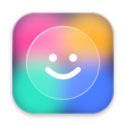

<p align="center">
  
</p>

<h1 align="center">Emoji</h1>

<p align="center">A fast macOS emoji picker. Press ⌥⇧Space (configurable from the menu-bar menu), pick an emoji, and it's pasted into whatever you were typing in.</p>

Needs macOS 14+. Liquid Glass on macOS 26+.

## Features

- **Global shortcut.** ⌥⇧Space opens the picker from anywhere. Pick another preset from the menu or record your own.
- **Types into what you were using.** The picker never takes focus from your app: choose an emoji and it is pasted at the cursor, and your clipboard is put back afterwards. It closes on Esc or a click elsewhere.
- **Every emoji, by category.** All 1,900+ emoji from the Unicode emoji list, with a bar along the bottom to jump between categories.
- **Recently used first.** The emoji you pick most recently sit at the top.
- **Search by name or keyword.** "happy" finds 😀 and "sao tome" finds 🇸🇹. It matches the start of words and ignores case and accents.
- **Keyboard first.** Arrow keys move through the grid and across categories, Return inserts, Esc closes.
- **Skin tones.** One setting applies to every emoji that has skin-tone variants.
- **Menu-bar icon your way.** Choose from six icons or hide it. The gear button in the picker opens the same menu.
- **Launch at login.**
- **Automatic updates.** Updates arrive through Sparkle with release notes in the update window, and you can check by hand from the menu.
- **Native look.** Liquid Glass on macOS 26 and later, a blurred material before that.
- **Signed and notarized**, so it opens without a Gatekeeper warning.

Pasting sends ⌘V, so macOS asks for Accessibility access the first time. Without it the emoji is left on your clipboard for you to paste.

## Develop

```
make help      # list targets
make dev       # build and relaunch "Emoji Dev.app" (own bundle id, settings and Accessibility grant)
make test
make lint
make release   # signed Emoji.app, not notarized
```

Grant Accessibility once per app (System Settings → Privacy & Security). It persists across rebuilds because
the builds are signed with a stable identity. `SIGN_ID=-` signs ad-hoc instead.

## Release

Releases are notarized and self-update through [Sparkle](https://sparkle-project.org). The GitHub release page is
the source of truth: what its notes say is what the update dialog shows.

```
git tag v0.1.0 && git push origin v0.1.0
```

1. **Tag** → the `Release` workflow builds, signs, notarizes and staples `Emoji.app`, and creates a **draft**
   release with `Emoji-0.1.0.dmg` and auto-generated notes.
2. **Edit the draft's notes** on GitHub: rewrite the generated commit list into a few user-facing highlights
   (what changed for someone using the app, not how). Markdown is fine.
3. **Publish** → the `Appcast` workflow builds a signed `appcast.xml` from the release (its DMG and its notes) and
   attaches it. The app reads it from `releases/latest/download/appcast.xml`.

Publish from the GitHub UI, or with `gh release edit v0.1.0 --draft=false`. Publishing a draft that has empty
notes fails the workflow on purpose: the update dialog would have nothing to show.

### One-time setup

**1. Sparkle keys.** The private key lands in your login keychain.

```
.build/artifacts/sparkle/Sparkle/bin/generate_keys                   # prints the public key
.build/artifacts/sparkle/Sparkle/bin/generate_keys -p > scripts/sparkle_public_key.txt   # commit this file
.build/artifacts/sparkle/Sparkle/bin/generate_keys -x sparkle.key    # export the private key
gh secret set SPARKLE_PRIVATE_KEY < sparkle.key && rm sparkle.key
```

Run `swift build` once first if `.build/artifacts` is missing. Losing the private key means existing installs can
never update, so keep a backup somewhere safe.

**2. Local notarization** (for `make notarize`). Uses an app-specific password from appleid.apple.com:

```
xcrun notarytool store-credentials emoji --apple-id YOU@EXAMPLE.COM --team-id B898J443L9
```

**3. CI secrets.**

| Secret | What |
|---|---|
| `DEVELOPER_ID_P12_BASE64` | Developer ID Application certificate + private key, exported from Keychain Access as `.p12`, then `base64 -i cert.p12` |
| `DEVELOPER_ID_P12_PASSWORD` | the password you chose on export |
| `NOTARY_KEY_P8_BASE64` | App Store Connect API key (`AuthKey_XXXX.p8`), `base64 -i AuthKey_XXXX.p8` |
| `NOTARY_KEY_ID`, `NOTARY_ISSUER_ID` | from the same page in App Store Connect |
| `SPARKLE_PRIVATE_KEY` | step 1 (used by the `Appcast` workflow) |

Set each with `gh secret set NAME < file` (or `--body`). A failed release run creates nothing: fix it, delete the
tag (`git push --delete origin v0.1.0 && git tag -d v0.1.0`) and push it again.

The build number (`CFBundleVersion`) is the commit count, which is what Sparkle compares, so it only ever goes up.
